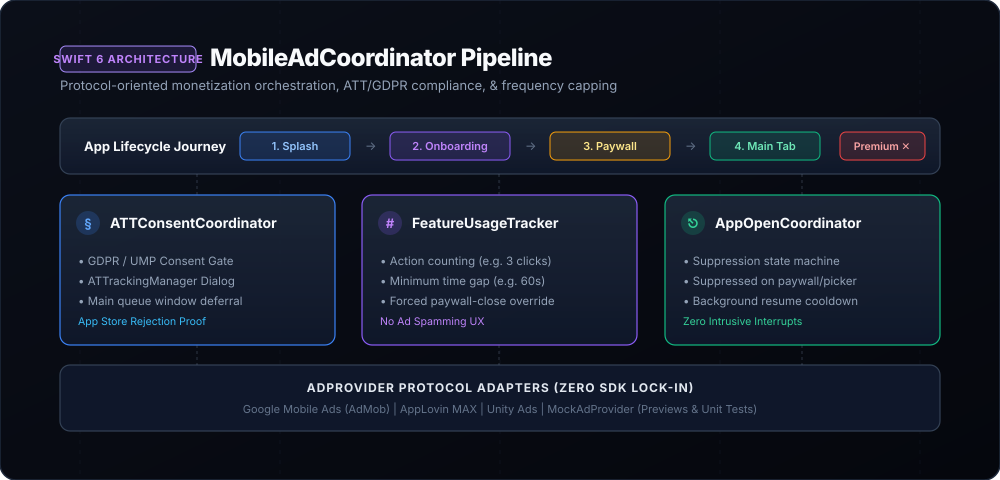

# MobileAdCoordinator



[](https://swift.org)
[](#platforms)
[](LICENSE)
[](#architecture)

A protocol-oriented mobile ad orchestration and privacy compliance framework for iOS apps. Eliminates tight ad SDK lock-in, prevents ad spam through frequency capping, coordinates Apple ATT & GDPR consent, and provides smooth SwiftUI integrations.

---

## The Problem

Most iOS apps integrate advertising SDKs directly inside ViewControllers and SwiftUI views. This causes:
1. **Ad SDK Lock-in**: Hard to switch between Google AdMob, AppLovin MAX, or IronSource without rewriting view code.
2. **Aggressive Ad Spam**: Displaying full-screen interstitials every few seconds damages retention and reviews.
3. **App Store Rejections**: Requesting App Tracking Transparency (ATT) before the view hierarchy is fully attached or failing GDPR/UMP consent flows.
4. **Poor App Open UX**: App Open ads appearing over paywalls, onboarding carousels, or document pickers.
5. **Untestable Code**: Ad SDKs crash SwiftUI Previews and cannot be mocked in automated unit/UI tests.

`MobileAdCoordinator` decouples ad presentation logic from concrete SDKs using pure Swift 6 concurrency.

---

## Highlights

- 🧩 **Zero SDK Lock-In (`AdProvider`)**: All ad presentation logic targets the clean `AdProvider` protocol. Switch mediation networks or use `MockAdProvider` in SwiftUI Previews and unit tests with 0 lines of view changes.
- ⏱️ **Frequency Capping & Action Intervals (`FeatureUsageTracker`)**: Configurable thresholds (e.g. show an interstitial every 3 user actions, but never more frequently than once every 60 seconds).
- 🛡️ **Privacy & ATT Compliance (`ATTConsentCoordinator`)**: Safely orchestrates GDPR / UMP consent followed by Apple's `ATTrackingManager` dialog on the main thread after window presentation.
- 🚫 **Smart App Open Suppression (`AppOpenAdCoordinator`)**: Prevents intrusive App Open ads during sensitive user flows (onboarding, paywalls, camera capture, or document import).
- 💎 **Instant Premium Bypass**: Built-in subscription entitlement check instantly bypasses all ad presentation without redundant checks in views.
- 🎨 **SwiftUI Native Modifiers**: Includes `.adLoadingOverlay()` and `.suppressAppOpenAds(when:reason:)`.

---

## Architecture Overview

```
User Action (Export / Save / Filter)
                │
                ▼
      MobileAdCoordinator
                ├── isPremiumUser? ──► [YES] ──► Bypass / Continue Immediately
                │
                └── [NO]
                     │
                     ▼
          FeatureUsageTracker
          • Action Count >= interval? (e.g. 3)
          • Time Gap >= minimumGapSeconds? (e.g. 60s)
                     │
                     ▼
           [Conditions Met]
                     │
                     ▼
           AdProvider Adapter
          (Google AdMob / AppLovin MAX / MockAdProvider)
```

---

## Installation

Add `MobileAdCoordinator` to your `Package.swift`:

```swift
dependencies: [
    .package(url: "https://github.com/nilkanthdesai76/swift-mobile-ad-coordinator.git", from: "1.0.0")
]
```

Or in Xcode: **File** → **Add Package Dependencies...** → Enter repository URL.

---

## Quick Start

### 1. Configure on App Launch

```swift
import SwiftUI
import MobileAdCoordinator

@main
struct MyApp: App {
    init() {
        MobileAdCoordinator.shared.configure(
            provider: GoogleAdMobAdapter(), // Concrete AdProvider adapter
            config: AdCoordinatorConfig(
                interstitialActionInterval: 3,
                interstitialGapSeconds: 60.0,
                appOpenCooldownSeconds: 120.0
            ),
            isPremiumCheck: {
                // Return entitlement from StoreKit 2 or RevenueCat
                SubscriptionManager.shared.isPremium
            }
        )
    }

    var body: some Scene {
        WindowGroup {
            ContentView()
        }
    }
}
```

### 2. Record User Actions & Present Interstitials

```swift
Button("Export PDF") {
    Task {
        // Trigger action
        let shouldShowAd = await MobileAdCoordinator.shared.recordAction()
        
        if shouldShowAd {
            await MobileAdCoordinator.shared.showInterstitial {
                performExport()
            }
        } else {
            performExport()
        }
    }
}
```

### 3. Forced Interstitial (e.g. On Paywall Close)

```swift
Button("Dismiss Paywall") {
    Task {
        await MobileAdCoordinator.shared.showInterstitial(forced: true) {
            dismissPaywall()
        }
    }
}
```

### 4. Suppress App Open Ads on Sensitive Views

```swift
struct PaywallView: View {
    @Environment(\.dismiss) private var dismiss

    var body: some View {
        VStack {
            Text("Unlock Unlimited Access")
            // ...
        }
        // Prevents App Open ads while user is reviewing plans
        .suppressAppOpenAds(when: true, reason: .paywallActive)
    }
}
```

---

## Concrete Adapter Example: Google AdMob

Implementing an `AdProvider` for Google Mobile Ads SDK takes only a few lines:

```swift
import Foundation
import MobileAdCoordinator
import GoogleMobileAds

public final class GoogleAdMobAdapter: AdProvider, @unchecked Sendable {
    private var interstitialAd: GADInterstitialAd?

    public func loadAd(placement: AdPlacement) async -> AdLoadResult {
        guard placement == .interstitial else { return .success }
        do {
            interstitialAd = try await GADInterstitialAd.load(
                withAdUnitID: "ca-app-pub-3940256099942544/4411468910",
                request: GADRequest()
            )
            return .success
        } catch {
            return .failure(error.localizedDescription)
        }
    }

    public func isAdReady(placement: AdPlacement) -> Bool {
        interstitialAd != nil
    }

    @MainActor
    public func presentAd(placement: AdPlacement, from viewController: UIViewController?, onDismiss: @escaping @Sendable () -> Void) -> Bool {
        guard let ad = interstitialAd, let vc = viewController else {
            onDismiss()
            return false
        }
        ad.present(fromRootViewController: vc)
        interstitialAd = nil
        onDismiss()
        return true
    }
}
```

---

## Testing & Mocking

In unit tests or Xcode Previews, use `MockAdProvider` without any network requests or third-party frameworks:

```swift
let mockProvider = MockAdProvider()
let coordinator = MobileAdCoordinator(
    provider: mockProvider,
    config: AdCoordinatorConfig(interstitialActionInterval: 1, interstitialGapSeconds: 0)
)

await coordinator.showInterstitial(forced: true) {
    print("Handled dismissal in test!")
}
```

---

## License

MIT License. See [LICENSE](LICENSE) for details.
Authored by [Nilkanth Desai](https://github.com/nilkanthdesai76).
